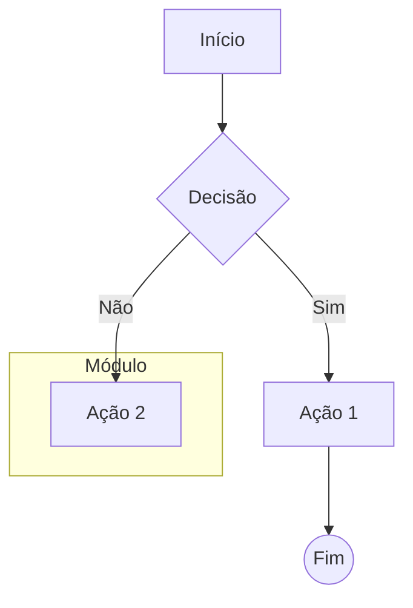
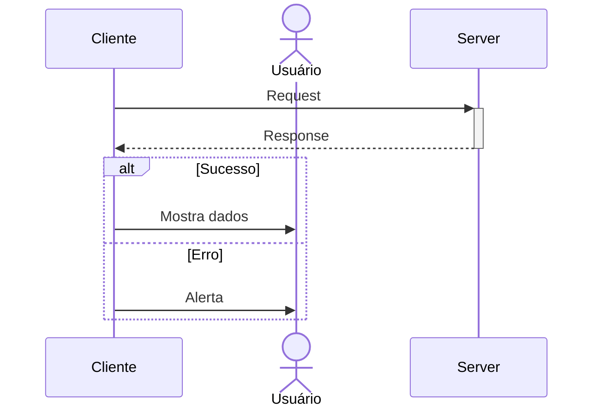
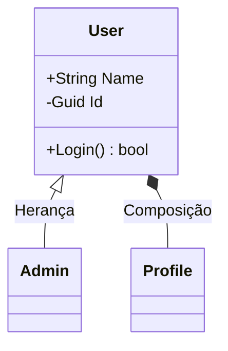
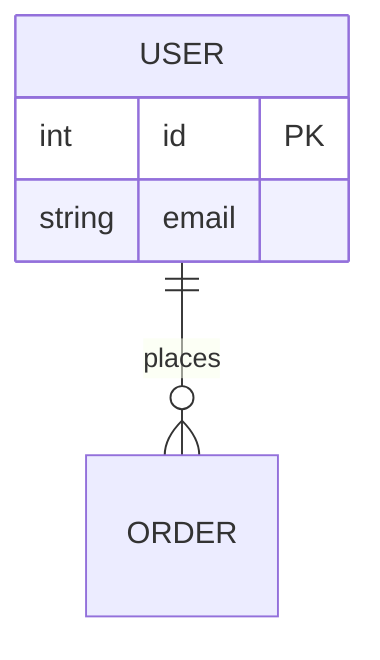

# Mermaid.js - Guia Rápido de Sintaxe

### 1. Flowchart (Diagramas de Fluxo)

- **Direções:** TD (Top-Down), LR (Left-Right), BT, RL.
- **Formas:** `[]` Retângulo, `()` Arredondado, `{}` Losango, `[[]]` Sub-rotina, `[()]` Banco de Dados.

### 2. Sequence Diagram (Diagramas de Sequência)

- **Mensagens:** `->>` Sólida, `-->>` Pontilhada, `-)` Assíncrona.
- **Blocos:** `alt/else`, `loop`, `opt`, `par`.

### 3. Class Diagram (Diagramas de Classe)

- **Relações:** `<|--` Herança, `*--` Composição, `o--` Agregação, `-->` Associação.
- **Visibilidade:** `+` Public, `-` Private, `#` Protected.

### 4. Entity Relationship (ER)

- **Cardinalidade:** `||--||` (1:1), `||--o{` (1:N), `}o--o{` (N:M).

### 5. Outros
- **State:** `stateDiagram-v2`, `[*] --> State1`, `State1 --> [*]`.
- **Mindmap:** `mindmap`, `root`, `child`.
- **Gantt:** `gantt`, `section`, `task :active, a1, 2024-01-01, 30d`.
